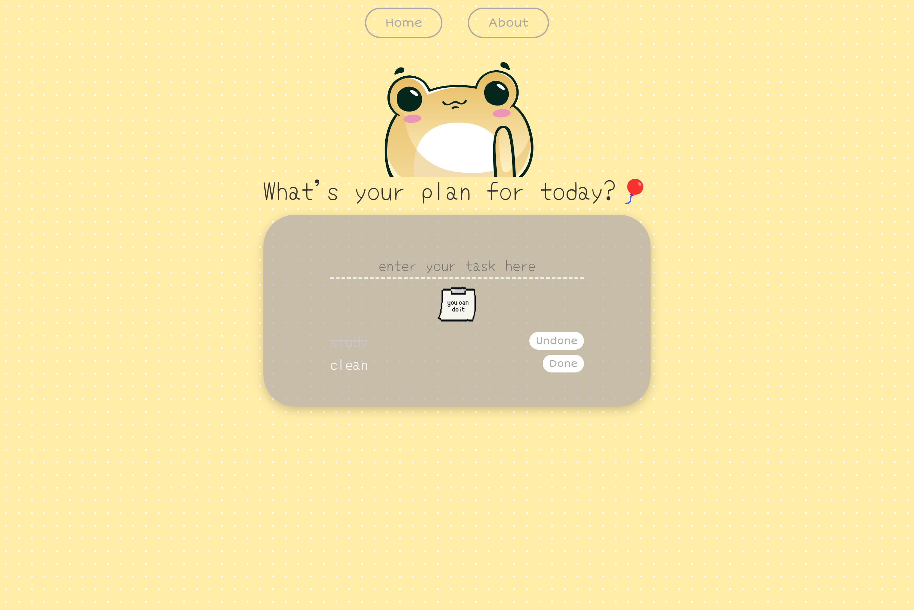

# 🗳️ Vue To-Do App

**🔗 Demo: https://tgvie.github.io/MI-todo-list/**

This is a responsive To-Do app built with Vite, Vue 3, and Pinia as a learning project. This app lets users add, mark, and manage their daily tasks with a simple and playful UI.

## 🖼️ Preview
|   |
| - |
|  |

### ✨ Featuring
- Add and display tasks
- Mark tasks as "Done" or "Undone" with a button
- Persistent task storage using localStorage

## 🛠️ Tech Stack

  
## ✍️ Author/s
🧑‍💻 [@tgvie](https://github.com/tgvie)

